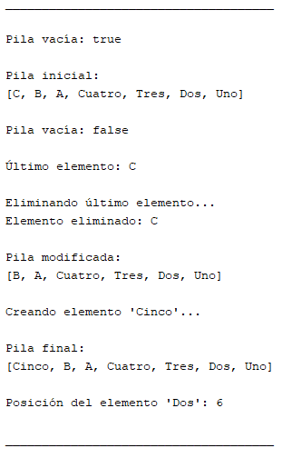
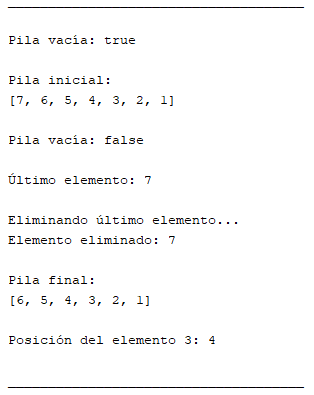
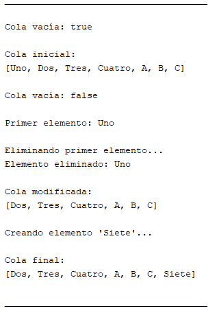
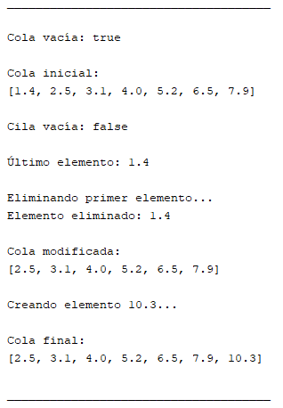

<table width="1000px">
    <theader>
        <tr>
            <td></td>
            <th>
                UNIVERSIDAD NACIONAL DE SAN AGUSTIN 
                FACULTAD DE INGENIERÍA DE PRODUCCIÓN Y SERVICIOS 
                DEPARTAMENTO ACADÉMICO DE INGENIERÍA DE SISTEMAS E INFORMÁTICA 
                ESCUELA PROFESIONAL DE INGENIERÍA DE SISTEMAS
            </th>
            <td></td>
        </tr>
    </theader>
    <tbody>
        <tr><td colspan="3">Formato: Guía de Práctica de Laboratorio</td></tr>
        <tr><td>Aprobación:  2022/03/01</td><td>Código: GUIA-PRLD-001</td><td>Página: 1</td></tr>
    </tbody>
</table>

    INFORME DE LABORATORIO 

    <table width="1000px">
        <theader>
            <tr><th colspan="6">INFORMACIÓN BÁSICA</th></tr>
        </theader>
        <tbody>
            <tr><td>ASIGNATURA:</td><td colspan="5">Estructura de Datos y Algoritmos</td></tr>
            <tr><td>TÍTULO DE LA PRÁCTICA:</td><td colspan="5">Pilas y Colas</td></tr>
            <tr><td>NÚMERO DE PRÁCTICA:</td><td>03</td><td>AÑO LECTIVO:</td><td>2022 A</td><td>NRO. SEMESTRE:</td><td width="60px">III</td></tr>
            <tr><td>FECHA DE PRESENTACIÓN:</td><td>05-Jun-2022</td><td>HORA DE PRESENTACIÓN:</td><td colspan="3">20:00</td></tr>
            <tr>
            <td colspan="4">INTEGRANTES:
                <ul>
            	    <li>Melsy Melany Huamaní Vargas 100% - mhuamanivar@unsa.edu.pe</li>
                    <li>Edith Lucero Vilcape Rosas 100% - evilcape@unsa.edu.pe</li>
                </ul>
            </td>
            <td>NOTA:</td>
            <td></td>
            </tr>
            <tr><td colspan="6" width="1000px">DOCENTES:
                <ul>
        	    <li>Richart Smith Escobedo Quispe - rescobedoq@unsa.edu.pe</li>
                </ul>
            </td>
            </tr>
        </tbody>
    </table>

    <table width="1000px">
        <theader>
            <tr><th>SOLUCIÓN Y RESULTADOS</th></tr>
        </theader>
        <tbody>
	    <tr><td>I. SOLUCIÓN DE EJERCICIOS/PROBLEMAS 
            En primer lugar dividimos los ejercicios y las preguntas correspondientes, donde se realizó cada parte con detalle. En algunas clases se puede observar que existen comentarios que ayudan a comprender más el código. Cada una de las integrantes realizó su parte en su respectiva rama y luego se unió el trabajo en la rama principal, todo ello se puede observar en el siguiente GitHub: <a href="https://github.com/mhuamanivar/EDA22A-GrupoD02-Lab03">https://github.com/mhuamanivar/EDA22A-GrupoD02-Lab03</a>  
            	<ul>
            	    <li>Aporte de "mhuamanivar": Ejercicio 2 (Pilas), Ejercicio 3 (Colas) y conclusión del tema.</li>
      		    	<li>Aporte de "evilcape": Ejercicio 1 (Pilas iguales) y las 2 preguntas del cuestionario.</li>
    	        </ul>
	    Además el trabajo se puede entender con facilidad en la guía que se colocó en la parte inferior después del informe.
            </td>
            </tr>
            <tr><td>II. SOLUCIÓN DEL CUESTIONARIO 
                <ul>
            	    <li>¿Qué similitudes hay entre una Lista Enlazada y una Pila? (1 pt)  
                    	
                    	
                    </li>
                     
      		    <li>¿En que casos seria favorable/desfavorable utilizar Pila/Cola? (1 pt)  
                    	
                    	
                        
                    	
                    </li>
    	        </ul>
            </td>
            </tr>
	    <tr><td>III. CONCLUSIONES 
		En conclusión, podemos asumir que estos tipos de estructuras nos facilitan el trabajo de ciertos problemas que debamos resolver a lo largo de nuestra carrera, ya que como se ha podido observar, las listas enlazadas, las pilas y colas, cumplen funcionalidades distintas según lo que deseamos resolver. Asimismo, existe una mayor eficiencia del algoritmo, y un menor uso de memoria, siendo simple, flexible y consistente, de esta manera nos permite realizar múltiples trabajos de manera más rápida. Es decir, conocer y estudiar el uso correcto de este tipo de estructuras nos facilitará el desarrollo de futuros problemas que tengamos que resolver en nuestra carrera, teniendo una gran variedad de maneras de utilizarlas en una situación determinada.</td>
            </tr>
        </tbody>
    </table>

    <table width="1000px">
        <theader>
            <tr><th>RETROALIMENTACIÓN GENERAL</th></tr>
        </theader>
        <tbody>
            <tr height="150px"><td width="1000px"></td></tr>
        </tbody>
    </table>

    <table width="1000px">
        <theader>
            <tr><th>REFERENCIAS Y BIBLIOGRAFÍA</th></tr>
        </theader>
        <tbody>
            <tr><td width="1000px">
		<ul>
            	    <li><a href="https://sites.google.com/site/estdatinfjiq/unidad-iii-listas-enlazadas">https://sites.google.com/site/estdatinfjiq/unidad-iii-listas-enlazadas</a></li>
            	    <li><a href="http://cidecame.uaeh.edu.mx/lcc/mapa/PROYECTO/libro9/operaciones_en_las_listas_enlazadas.html">http://cidecame.uaeh.edu.mx/lcc/mapa/PROYECTO/libro9/operaciones_en_las_listas_enlazadas.html</a></li>
            	    <li><a href="https://www.cartagena99.com/recursos/alumnos/apuntes/ListasEnlazadas.pdf">https://www.cartagena99.com/recursos/alumnos/apuntes/ListasEnlazadas.pdf</a></li>
            	    <li><a href="https://ccc.inaoep.mx/ingreso/programacion/corto2015/Curso-PROPE-PyED-5-Pilas-Colas.pdf">https://ccc.inaoep.mx/ingreso/programacion/corto2015/Curso-PROPE-PyED-5-Pilas-Colas.pdf</a></li>
            	    <li><a href="https://www.ecured.cu/Pila_(Estructura_de_datos)">https://www.ecured.cu/Pila_(Estructura_de_datos)</a></li>
            	    <li><a href="https://www.academia.edu/16548532/PILA">https://www.academia.edu/16548532/PILA</a></li>
            	    <li><a href="https://www.ubiquitour.com/5WdB3kjO/">https://www.ubiquitour.com/5WdB3kjO/</a></li>
            	    <li><a href="https://www.informatica-juridica.com/wp-content/uploads/2014/01/Documentacion_Biblioteca_Estructuras_Datos_Avanzadas.pdf">https://www.informatica-juridica.com/wp-content/uploads/2014/01/Documentacion_Biblioteca_Estructuras_Datos_Avanzadas.pdf</a></li>
    		</ul>
	    	</td></tr>
        </tbody>
    </table>

#

## GUÍA DEL TRABAJO

1. Pilas iguales (6 puntos)

	- Explicación
    
2. Pilas (6 puntos)

	- En primer lugar, se creó la clase "Node" en la cual se utilizan valores de tipo genérico T para guardar los valores del dato, y también un atributo de tipo Node, que señalaría al siguiente nodo que se tiene enlazado. Se crean también los constructores, setters y getters.

	- En segundo lugar, se crea la clase "Stack", el cual utiliza un solo atributo de tipo Node, ya que este se enlazaría a los demás tipos de Node.

		- Se crea el constructor con el tope vacío, puesto que aún no existe ningún nodo en la pila.
		- Se crea un método con retorno booleano, llamado "pilaVacia()" que dará true si es que el tope está vacío y false si es que no lo está, debido a que el tope ya sería un nuevo elemento.
		- Se crea un método con retorno genérico T, llamado "ultimoNodo()" que retorna el dato de tipo T que se encuentra guardado en el último nodo guardado, es decir, el tope.
		- Se crea un método de retorno T, llamado "eliminarNodo()" que sigue la misma estrategia que el anterior, retornando el dato de tipo T del tope de la pila, luego de ello se elimina ese tope, quedando como tope el nodo siguiente.
		- Se crea un método sin retorno, llamado "crearNodo()" que recibe un dato genérico T para guardarlo en el nuevo nodo, y este nuevo nodo se enlazará al tope existente, luego de ello se convertirá en el nuevo tope de la pila.
		- Se crea un método de retorno entero, llamado "buscarNodo()", que recibe un dato genérico T para buscarlo entre los datos existentes de los nodos de la pila, es así que primero se busca recorrer toda la pila hasta que se llegue al nodo vacío que se creó en el constructor. Si es que encuentra el dato, retorna la posición en donde se encontró, de lo contrario retornará 0.
		- Se crea método sobrescrito "toString()", para que imprima los datos de los nodos de la pila siguiendo el orden en el que fueron colocados uno por uno, por lo que recorre toda la pila.

	- En último lugar, se crea la clase principal "Pilas_principal" en el cual se prueba creando dos pilas, una de tipo String y otra de tipo Integer, en ambos casos se prueba cada método creado de la clase Stack, todo ello siguiendo los estándares de la propia clase Stack que tiene Java.

		- Ejecución de la primera pila de tipo String
		- 
		- Ejecución de la segunda pila de tipo Integer
		-  
    
3. Colas (6 puntos)

	- En primer lugar, se utilizó la clase "Node" creada en el ejercicio anterior, en la cual se utilizan valores de tipo genérico T para guardar los valores del dato, y también un atributo de tipo Node, que señalaría al siguiente nodo que se tiene enlazado. Se crean también los constructores, setters y getters.

	- En segundo lugar, se crea la clase "Queue", el cual utilizan dos atributos de tipo Node, uno denominado root (raíz) y otro tope, el primer Node enlazará al primer nodo que fue agregado, mientras que el Node denominado tope enlazará al último nodo que fue agregado a la cola.

		- Se crea el constructor con el tope y la raíz vacía, puesto que aún no existe ningún nodo en la cola.
		- Se crea un método con retorno booleano, llamado "colaVacia()" que dará true si es que el tope está vacío y false si es que no lo está, debido a que el tope ya señalaría a un nuevo elemento.
		- Se crea un método con retorno genérico T, llamado "primerNodo()" que retorna el dato de tipo T que se encuentra guardado en el primer nodo guardado, es decir, aquel nodo que señala la raíz.
		- Se crea un método de retorno T, llamado "eliminarNodo()" que sigue la misma estrategia que el anterior, retornando el dato de tipo T del nodo que señala la raíz de la cola, luego de ello se elimina ese nodo, quedando como raíz el nodo siguiente.
		- Se crea un método sin retorno, llamado "crearNodo()" que recibe un dato genérico T para guardarlo en el nuevo nodo. Si es que es el primer nodo, se inicializan los nodos tope y raíz con datos vacíos y ambos señalando al primer nodo creado. Si se crean más nodos, entonces simplemente, el antiguo nodo que señalaba el tope señalará como nodo siguiente al nodo creado y el tope cambiará, señalando ahora al nuevo nodo.
		- Se crea método sobrescrito "toString()", para que imprima los datos de los nodos de la cola siguiendo el orden en el que fueron colocados uno por uno desde la raíz, por lo que recorre toda la cola.

	- En último lugar, se crea la clase principal "Colas_principal" en el cual se prueba creando dos colas, una de tipo String y otra de tipo Double, en ambos casos se prueba cada método creado de la clase Queue, todo ello siguiendo los estándares de la propia clase Queue que tiene Java.

		- Ejecución de la primera cola de tipo String
		- 
		- Ejecución de la segunda cola de tipo Double
		-  
		
